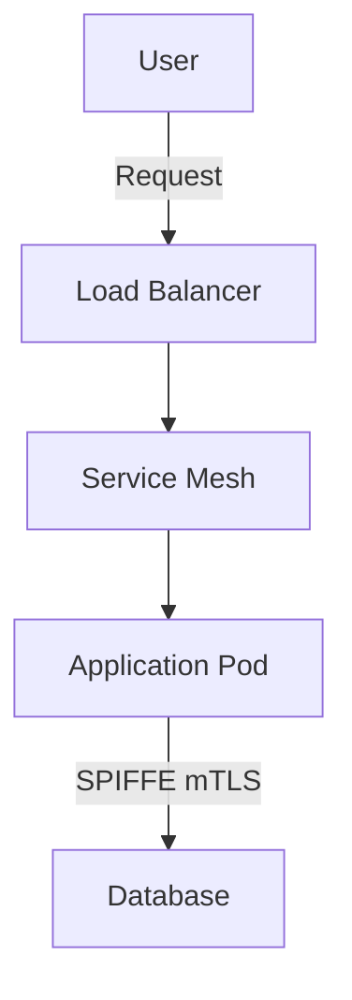

# Writing Guide for Digital Sovereignty Paper

## Purpose

This guide ensures consistency across all sections of the paper, maintaining the right balance between technical depth and executive accessibility.

---

## Section Structure Template

Each section should follow this structure:

```markdown
# [Section Title]

## Executive Summary

[2-3 concise paragraphs, max 300 words total]
- What is this about? (1 sentence)
- Why does it matter for digital sovereignty? (2-3 sentences)
- What's the key takeaway? (1-2 sentences)

---

## [Introduction/Context Section]

[Set up the problem or context]

### [Subsection]

[Content with technical details]

**[Key Points in Bold]:**
- List format for clarity
- Bullet points for scannability
- Bold for emphasis

---

## Technical Deep Dive: [Core Topic]

[Detailed technical content]

### [Technical Subsection]

[In-depth explanation]

```[language]
# Example code or configuration
# With clear comments
```

[Explanation of the example]

---

## [Use Cases / Practical Applications]

[Real-world scenarios]

---

## The Upstream Connection

[How Red Hat contributes to and leads in relevant upstream projects]

**Key Contributions:**
- Specific project contributions
- Maintainers and leadership roles
- Engineering investment

---

## Key Benefits Summary

**For Technical Teams:**
- [Benefit 1]
- [Benefit 2]

**For Organizations:**
- [Benefit 1]
- [Benefit 2]

**For Digital Sovereignty:**
- [Benefit 1]
- [Benefit 2]

---

## References and Further Reading

- [Upstream Project Links]
- [Red Hat Documentation]
- [Industry Standards]
- [Related Papers/Articles]
```

---

## Writing Style Guidelines

### Tone and Voice

**Do:**
- Use active voice: "Red Hat contributes to..." not "Contributions are made by..."
- Be confident but not arrogant: "This approach provides..." not "This is the best..."
- Be specific: "Reduces onboarding time by 80%" not "Significantly faster"
- Balance advocacy with objectivity: Explain trade-offs honestly

**Don't:**
- Use marketing hyperbole: "Revolutionary," "game-changing," "best in class"
- Make unfounded claims: Always back assertions with evidence
- Diminish alternatives: Focus on strengths, not competitor weakness
- Use jargon without explanation: Define terms on first use

### Technical Depth

**Executive Summaries:**
- No code examples
- Minimal technical terminology
- Focus on business outcomes
- Clear cause and effect

**Technical Deep Dives:**
- Include code examples
- Explain architecture patterns
- Reference specific versions and features
- Provide command-line examples
- Include diagrams (described in markdown, to be visualized later)

### Examples and Use Cases

**Make them realistic:**
- Based on real customer patterns (anonymized)
- Include specific metrics where possible
- Show before/after comparisons
- Explain trade-offs and challenges

**Example Template:**
```markdown
### Real-World Example: [Descriptive Title]

**Organization Profile:**
- Size: [number] developers
- Industry: [sector]
- Challenges: [3-5 specific challenges]

**Solution:**
1. [Step 1]
2. [Step 2]
3. [Step 3]

**Results:**
- [Metric 1]: [before] → [after]
- [Metric 2]: [improvement]
- [Qualitative benefit]
```

---

## Code Example Guidelines

### Format

```language
# Always include comments
# Explain what the code does
# Point out key features

command --flag value  # Inline comments for specific flags
```

### Include Context

Before every code example:
- Explain what problem it solves
- Describe what the example demonstrates
- Note any prerequisites or assumptions

After every code example:
- Explain key elements
- Point out best practices shown
- Note what to modify for different scenarios

### Languages and Tools

**Preferred for examples:**
- YAML for Kubernetes/OpenShift manifests
- Bash for CLI commands
- Python for application examples
- Go for cloud-native tooling examples
- SQL for database examples

**Always specify language in code fences:**
```yaml   # Good
```        # Bad
```

---

## Linking and References

### Internal Links

Link to other sections when relevant:
```markdown
As discussed in [Supply Chain Security](03-supply-chain.md), signing artifacts is essential...

See the [Confidential Containers](08-confidential-containers.md#use-cases) section for AI use cases.
```

### External Links

**For upstream projects:**
- Link to official project page
- Link to specific documentation when referencing a feature
- Include GitHub repository links

**For Red Hat products:**
- Link to product pages
- Link to documentation
- Link to blog posts or technical articles

**Format:**
```markdown
- [Project Name](https://url.com) - Brief description
- [Specific Feature Documentation](https://url.com/docs/feature)
```

---

## Emphasizing Digital Sovereignty

Every section should connect back to digital sovereignty themes. Include at least one of:

1. **Freedom from Lock-in**
   - How this enables cloud portability
   - Ability to change vendors or infrastructure

2. **Transparency and Control**
   - Open source visibility
   - Ability to audit and modify
   - No hidden dependencies

3. **Regulatory Compliance**
   - Data sovereignty requirements
   - Industry-specific regulations
   - Geographic restrictions

4. **Strategic Independence**
   - Reduced geopolitical risk
   - Technology autonomy
   - Long-term sustainability

---

## The "Upstream Connection" Section

Every major section includes this. Address:

1. **Specific Contributions**
   - Name the upstream projects
   - Quantify Red Hat's involvement (number of maintainers, commits, etc.)
   - Highlight leadership roles (steering committee, SIG leads, etc.)

2. **Engineering Investment**
   - FTEs dedicated to the project
   - Types of contributions (features, bug fixes, security, documentation)
   - Long-term commitment

3. **Community Benefits**
   - How Red Hat's investment helps everyone
   - Innovations contributed back
   - Community growth and sustainability

**Example:**
```markdown
## The Upstream Connection

### Red Hat's Kubernetes Contributions

Red Hat is one of the top contributors to Kubernetes, with 100+ engineers working on the project daily.

**Leadership Roles:**
- 12 Kubernetes maintainers
- 3 Steering Committee members
- Leads in SIG-Auth, SIG-Node, and SIG-Storage

**Key Contributions:**
- OpenShift Container Storage (OCS) → Rook/Ceph integration
- CRI-O container runtime (Red Hat led)
- Operator Framework and Operator Lifecycle Manager
- Security enhancements and CVE fixes
```

---

## Key Benefits Summary Format

Always use this exact structure:

```markdown
## Key Benefits Summary

**For Technical Teams:**
- [Specific technical benefit with technical impact]
- [Developer productivity benefit]
- [Operational benefit]

**For Organizations:**
- [Business benefit with metrics if possible]
- [Risk mitigation benefit]
- [Cost or efficiency benefit]

**For Digital Sovereignty:**
- [Lock-in reduction benefit]
- [Control or transparency benefit]
- [Compliance or regulatory benefit]
```

---

## Figures and Diagrams

For complex architectures, describe diagrams in markdown. These can be visualized later with tools like Mermaid, PlantUML, or custom graphics.

**Format:**
```markdown
### Architecture Diagram

```
[Describe the diagram in structured text]

┌─────────────────────────────────────────┐
│         Component Name                  │
│  ┌───────────────────────────────────┐  │
│  │  Subcomponent                     │  │
│  │  - Detail 1                       │  │
│  │  - Detail 2                       │  │
│  └───────────────────────────────────┘  │
│                                         │
│  ┌───────────────────────────────────┐  │
│  │  Another Subcomponent             │  │
│  └───────────────────────────────────┘  │
└─────────────────────────────────────────┘
         │
         ▼
┌─────────────────────────────────────────┐
│         Connected Component             │
└─────────────────────────────────────────┘
```
```

Or use Mermaid syntax:
````markdown

````

---

## Metrics and Data

When including performance or business metrics:

**Do:**
- Cite sources when possible
- Use realistic, conservative numbers
- Explain methodology if relevant
- Provide context (baseline, comparison)

**Don't:**
- Use vague terms: "significantly faster"
- Cherry-pick extreme outliers
- Compare apples to oranges
- Claim results without evidence

**Example:**
```markdown
✅ Good: "Reduced deployment time from 2 hours to 15 minutes (87% reduction)"
❌ Bad: "Deployments are dramatically faster"

✅ Good: "Based on internal testing with 50 microservices"
❌ Bad: "Our tests show enormous improvements"
```

---

## Review Checklist

Before considering a section complete:

- [ ] Executive summary is under 300 words and understandable without technical background
- [ ] Technical deep dive includes at least one code/configuration example
- [ ] Real-world use case or example included
- [ ] "Upstream Connection" section filled out
- [ ] "Key Benefits Summary" follows standard format
- [ ] At least 3 external references/links
- [ ] Connection to digital sovereignty theme is explicit
- [ ] No marketing hyperbole
- [ ] All code examples have explanatory comments
- [ ] Technical terms defined on first use
- [ ] All claims are backed by evidence or examples

---

## Suggested Writing Process

1. **Start with Executive Summary**
   - Forces clarity on key message
   - Defines scope of section

2. **Write Technical Deep Dive**
   - Include code examples
   - Add architectural explanations

3. **Add Real-World Example**
   - Make it concrete
   - Show business impact

4. **Fill in Upstream Connection**
   - Research Red Hat's contributions
   - Quantify involvement

5. **Complete Key Benefits**
   - Ensure all audiences addressed
   - Connect to sovereignty themes

6. **Write Introduction/Context**
   - Now that you know where you're going
   - Can introduce effectively

7. **Add References**
   - Link to sources used
   - Provide further reading

8. **Review and Refine**
   - Check against checklist
   - Ensure consistency with other sections
   - Validate code examples

---

## Questions to Ask While Writing

For every section:

1. **So what?** - Why should the reader care about this?
2. **How does this enable sovereignty?** - Connect to the core theme
3. **What can readers do with this information?** - Make it actionable
4. **Is this true?** - Can I back this up with evidence?
5. **Would a non-expert understand the executive summary?** - Test it
6. **Would an expert find the technical content valuable?** - Don't oversimplify

---

## Common Pitfalls to Avoid

1. **Too much abstraction**: Use concrete examples
2. **Vendor bashing**: Focus on your strengths, not others' weaknesses
3. **Feature lists**: Explain the "why," not just the "what"
4. **Jargon overload**: Define terms, use analogies
5. **Missing the forest for the trees**: Always connect details back to sovereignty
6. **One-size-fits-all**: Different audiences need different depth
7. **Unsubstantiated claims**: "Best," "fastest," "only" need proof

---

## Getting Unstuck

If you're struggling with a section:

1. **Start with the example**: Write a real-world scenario first
2. **Explain it to a colleague**: Then write what you said
3. **Look at Red Hat blogs**: See how others explain the topic
4. **Check upstream docs**: Use project explanations as foundation
5. **Ask "why" five times**: Get to the root value proposition
6. **Simplify, then add**: Start simple, layer complexity

---

## Final Polish

Before publishing:

1. **Read aloud**: Catches awkward phrasing
2. **Check links**: Ensure all URLs work
3. **Test code examples**: Verify they're correct
4. **Get peer review**: Technical and non-technical reviewers
5. **Consistency check**: Terminology, formatting, style
6. **Executive test**: Can a non-technical leader understand the summaries?
7. **Technical test**: Does a developer find it credible and useful?

---

**Remember**: This paper should educate and persuade, not just describe. Every section should leave readers better informed and more convinced of the value of digital sovereignty through enterprise-grade open source.
